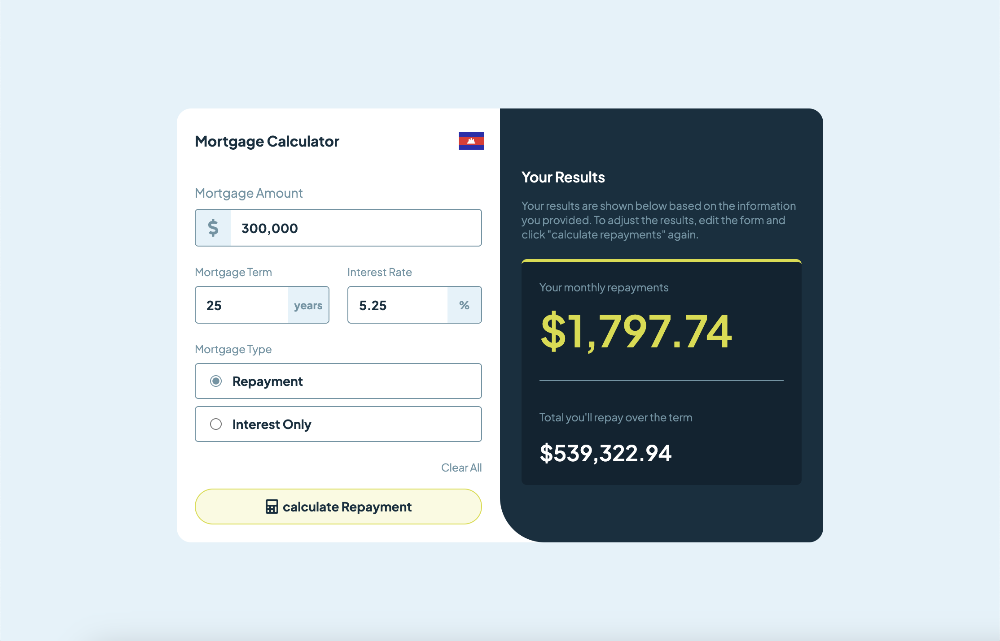
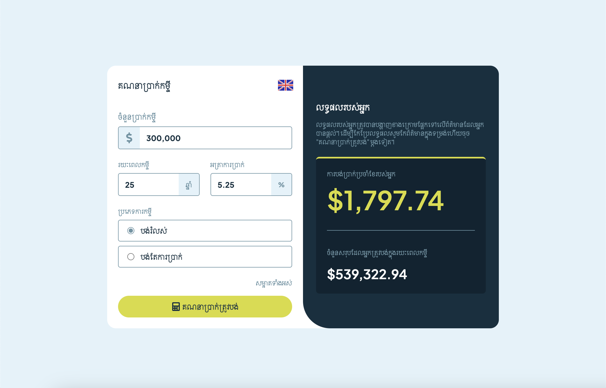

# 🏠 LoanRanger

Calculate monthly mortgage repayments based on loan amount, interest rate, term, and mortgage type. Built with a clean UI and responsive layout using React, Vite, and Tailwind CSS.

## 🚀 Live Demo

Check it out here: [https://loan-ranger.vercel.app/](https://loan-ranger.vercel.app/)

## ✨ Features

- 🧮 Calculate **monthly repayments** and **total repayment**
- 📊 Choose between **Repayment** and **Interest-Only** mortgages
- 💸 Input loan amount, interest rate, and term (with validation)
- 🇰🇭 English to Khmer translation
- 🌐 Fully responsive and mobile-friendly
- ⚡ Built with **React**, **Vite**, and **Tailwind CSS**

## 📸 Screenshot






## 💡 Getting Started

### 1. Clone the repo

```bash
git clone https://github.com/Sereyvidya/LoanRanger
cd LoanRanger
```

### 2. Install dependencies

```bash
npm install
```

### 3. Run the development server

```bash
npm run dev
```

App will be running at: `http://localhost:5173`

## 🛠 Tech Stack

- ⚛️ React
- ⚡ Vite
- 🎨 Tailwind CSS
- 📦 `react-icons`

## 📁 Folder Structure

```bash
├── public/
│   ├── calculator.svg
│   ├── kh.png
│   └── uk.png
├── src/
│   ├── components/
│   │   ├── CalculatorForm.jsx
│   │   └── MortgageResult.jsx
│   ├── utils/
│   │   └── helper.js
│   ├── App.jsx
│   └── index.css
├── index.html
└── package.json
```

## 🙌 Credits

- - Inspired by the [Mortgage repayment calculator](https://www.frontendmentor.io/challenges/mortgage-repayment-calculator-Galx1LXK73) challenge from Frontend Mentor.

## 🪪 License

MIT — free to use, remix, and build upon!
